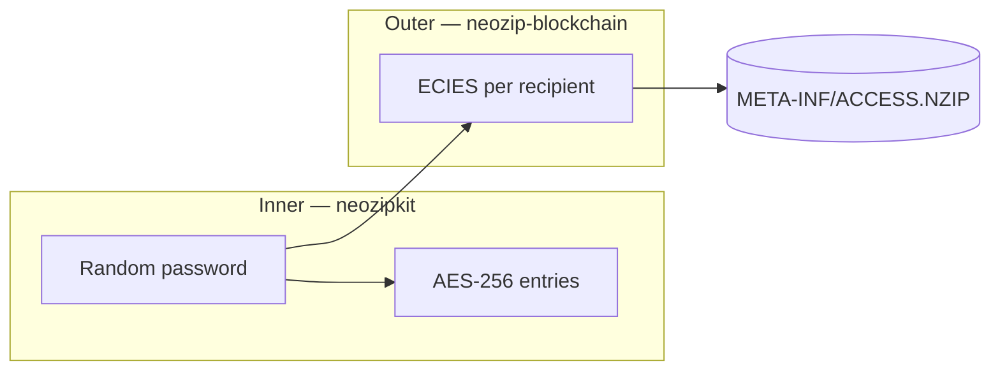

# Recipient-based encryption in NeoZipKit Pro

This document describes how **identity-based (recipient) encryption** works in `neozip-blockchain`: how a `.nzip` archive is encrypted so that only holders of specific **secp256k1 private keys** can recover the symmetric key and read the contents.

Implementation lives under `src/encryption/` and `src/identity/`.

---

## 1. Goals

- **Encrypt ZIP entry data** using **neozipkit**’s **NeoEncrypt** (**`neo-aes256`**, NEO extra field `0x024E`) by default — no duplicate crypto for file bytes. (WinZip-compatible AES is optional via `zipEncryptionMethod: 'aes256'`.)
- **Bind access to blockchain identities** by wrapping the inner symmetric secret with each recipient’s **public encryption key** (hybrid encryption).
- **Store access metadata** inside the archive at a well-known path so recipients can discover which wrapped key is theirs and unwrap it offline (after they have the file).

---

## 2. What is protected (and what is not)

| Protected | Not hidden from someone with the file |
|-----------|----------------------------------------|
| Payload of encrypted ZIP entries (names/streams protected by AES as implemented by neozipkit) | Presence of `META-INF/ACCESS.NZIP` and its **JSON contents** (recipient identities, wrapped key blobs, algorithms, timestamps) |
| The random inner “password” until someone unwraps it with a listed private key | **Who** can decrypt (recipient addresses / ENS names as recorded) |

The wrapped keys in `ACCESS.NZIP` are **ciphertext**. Without the correct **private key**, they should not yield the inner password. Metadata still leaks **social/graph** information (who was targeted).

---

## 3. Hybrid encryption model

NeoZipKit Pro uses a standard **hybrid** design:

1. **Symmetric layer (inner):** A high-entropy secret is used as the **password** for neozipkit’s **NeoEncrypt** encryption (`neo-aes256`) of all normal file entries by default.
2. **Asymmetric layer (outer):** That same secret is **encrypted separately for each recipient** using **ECIES** on **secp256k1**, so only each recipient’s private key can recover it.

---

## 4. Inner layer: neozipkit NeoEncrypt (`neo-aes256`)

1. The orchestrator generates **32 random bytes** and encodes them as a **64-character hex string**.
2. That string is passed to neozipkit as `CompressOptions.password` with `encryptionMethod: 'neo-aes256'` (default). This uses **NeoEncrypt**: standard ZIP compression method in headers, encryption indicated by the **NEO crypto extra field (`0x024E`)** — see [neozipkit `docs/NEO_CRYPTO_FORMAT.md`](https://github.com/NeoWareInc/neozipkit/blob/main/docs/NEO_CRYPTO_FORMAT.md) in the neozipkit repo.
3. neozipkit derives keys with **PBKDF2** and encrypts entry payloads (same ciphertext layout family as WinZip AES; NeoEncrypt is NeoZip’s native AES-256 path). Using a random hex string as the password is intentional: the secret is high-entropy.

To produce **WinZip AE-1/AE-2**–compatible entry encryption instead, pass `zipEncryptionMethod: 'aes256'` in `RecipientEncryptionOptions`.

All **user files** in the archive are written through this encrypted path. The access-metadata file is written as a **separate, stored, unencrypted** entry (see below).

---

## 5. Outer layer: ECIES key wrapping

Key wrapping is implemented in `KeyWrapper.ts` using **@noble/curves** (secp256k1) and **@noble/hashes**, with **Node.js `crypto`** for AES-GCM.

**Algorithm identifier stored in metadata:** `ecies-secp256k1-aes256gcm`.

### 5.1 Wrap (encrypt the inner password for one recipient)

1. Parse the recipient’s **uncompressed secp256k1 public key** (hex, `04` prefix, 130 hex characters).
2. Generate an **ephemeral** secp256k1 key pair.
3. **ECDH:** shared secret from ephemeral private key × recipient public point (uncompressed).
4. **HKDF-SHA256** over the shared secret (implementation detail: uses the X/Y coordinate bytes with a fixed `info` string — see source) to derive a **32-byte wrapping key**.
5. **AES-256-GCM** encrypt the **UTF-8 bytes of the inner password** (the hex string) with a random 12-byte IV.
6. Encode ciphertext for storage: **`IV (12) || auth tag (16) || ciphertext`**, then **base64**.
7. Store the **ephemeral public key** (uncompressed hex) alongside the ciphertext — required for unwrap.

### 5.2 Unwrap (recipient)

1. **ECDH:** recipient private key × ephemeral public point → same shared secret.
2. Same **HKDF** → same wrapping key.
3. **AES-256-GCM** decrypt; verify authentication tag.

### 5.3 Matching recipient on decrypt

The recipient’s **public key** is derived from their **private key** with `publicKeyFromPrivate` and compared (case-insensitive) to entries in `ACCESS.NZIP`. The matching entry supplies `wrappedKey` and `ephemeralPublicKey` for `unwrapKey`.

---

## 6. `META-INF/ACCESS.NZIP`

Path inside the archive: **`META-INF/ACCESS.NZIP`**.

- Written as a normal ZIP entry with **method STORED** (no extra compression) and **without** the AES password, so the JSON is readable by any tool that opens the ZIP.
- Content is **UTF-8 JSON** (pretty-printed in current serializer).

### 6.1 Top-level fields

| Field | Purpose |
|-------|---------|
| `version` | Metadata format version (e.g. `"1.0"`) |
| `scheme` | e.g. `ens-hybrid`, `address-hybrid` — labels how identities were resolved |
| `recipients` | Array of per-recipient records |
| `encryption` | Describes inner method (`neo-aes256` by default, or `aes-256-winzip` if WinZip AES was selected) and notes |
| `created` | ISO-8601 timestamp |
| `proVersion` | NeoZipKit Pro package version string |

### 6.2 Each object in `recipients`

| Field | Purpose |
|-------|---------|
| `identity` | Original string (e.g. ENS name or `0x…` address) |
| `identityType` | `ens` \| `address` \| `did` \| `lit-pkp` |
| `resolvedAddress` | Checksummed Ethereum address where applicable |
| `publicKeyHex` | Uncompressed secp256k1 public key used for wrapping |
| `wrappedKey` | Base64 ECIES payload |
| `ephemeralPublicKey` | Hex ephemeral public key |
| `keyAlgorithm` | e.g. `ecies-secp256k1-aes256gcm` |

Parsing and validation are strict enough to reject obvious corruption; see `AccessMetadata.ts`.

---

## 7. End-to-end encryption workflow

High-level steps performed by `encryptForRecipients` (`RecipientEncryption.ts`):

1. Require at least one **resolved** recipient (`ResolvedIdentity`: identity, type, address, `publicKeyHex`). All recipients in one archive must share the **same** `identityType` (you cannot mix e.g. ENS and Lit PKP in v1).
2. Generate the **random inner password** (32 bytes → hex string).
3. Open the output archive and **write each input file** with neozipkit using NeoEncrypt (`neo-aes256` by default) and that password.
4. For **each recipient**, run **ECIES wrap** on the UTF-8 encoding of the password string.
5. **Build** `AccessControlMetadata`, **serialize** to JSON buffer.
6. Write **`META-INF/ACCESS.NZIP`** via a temporary file (stored entry, no encryption).
7. Write **central directory** and **end-of-central-directory** record and finalize.

---

## 8. End-to-end decryption workflow

High-level steps performed by `decryptAsRecipient`:

1. **Load** the archive.
2. Locate **`META-INF/ACCESS.NZIP`**, extract bytes (hash check skipped for that entry as implemented).
3. **Parse** JSON → `AccessControlMetadata`.
4. Derive **public key from the supplied private key**; find the **matching** `recipients[]` entry.
5. **Unwrap** → recover the inner password string; assign it to the zipkit instance (implementation sets `password` on the node instance) so **neozipkit** can decrypt entries on read.
6. Caller uses normal zipkit APIs (e.g. `extractToBuffer`) for encrypted entries.

If no recipient matches the key, decryption fails with an explicit error (wrong key).

---

## 9. Identity resolution and public keys

Encryption targets are described by **`ResolvedIdentity`**: you must end up with a **trusted uncompressed public key** per recipient.

### 9.1 ENS (`ENSResolver`)

- Resolver applies to identities ending in **`.eth`**.
- Uses an **ethers.js** provider: resolve name → resolver → **`getText('io.neozip.pubkey')`**.
- Record value must be a valid **uncompressed secp256k1 public key** (hex). If the record is missing, resolution fails — the name owner must **publish** that text record.

### 9.2 Raw address (`AddressResolver`)

- Matches `0x` + 40 hex characters.
- **An Ethereum address alone does not determine a unique public key** from chain data inside this library. Callers must supply **`publicKeyHex`** when resolving (e.g. from a prior secure channel, signature recovery, or another registry).

### 9.3 Dispatch (`IdentityResolverDispatch`)

Combines resolvers so a single pipeline can try ENS vs address rules. Register **`LitPkpResolver`** (see below) via the `extra` argument or `addResolver` so `pkp:0x…` strings are handled; it is not enabled by default.

### 9.4 Lit Programmable Key Pair — mode B (`LitPkpResolver`)

NeoZipKit Pro can target a **Lit PKP** as a normal **ECIES recipient**: the outer wrap is still `ecies-secp256k1-aes256gcm` to the PKP’s **uncompressed secp256k1 public key**. No Lit node round-trip is required to **encrypt** the archive; decryption still uses `decryptAsRecipient` with the key that matches that public key (how your app obtains PKP signatures or key material is outside this library).

- **Identity string:** `pkp:` + the PKP’s **Ethereum address** (checksummed or not in input; resolution normalizes via ethers), e.g. `pkp:0x742d35Cc6634C0532925a3b844Bc9e7595f0bEb0`.
- **`identityType`:** `lit-pkp` on the resulting `ResolvedIdentity`.
- **Metadata `scheme`:** `lit-protocol` (not `lit-pkp-hybrid`).
- **Public key:** Like a raw `address` recipient, the **public key cannot be derived from the address** inside this package. Pass **`publicKeyHex`** when calling `LitPkpResolver.resolve` (or build `ResolvedIdentity` yourself). Obtain it from **Lit SDK**, Lit dashboard, or your own indexer. **`@lit-protocol/lit-node-client`** is listed as an **optional** peer dependency for apps that already use Lit to fetch PKP metadata; this repo does not call it from core code.

**Trust:** Same as raw addresses — verify the pubkey through your product (fingerprint, secondary channel, etc.). **Lit Access Control Conditions (ACCs)** and threshold decryption of the inner secret **without** possession of the usual secp256k1 unwrap key are **not** part of this path; they would require a different outer encryption design.

---

## 10. Multiple recipients

Each recipient gets **their own** ECIES wrap of the **same** inner password. Any listed private key can unwrap and then decrypt the same AES layer. This supports **sender + recipient**, **multiple recipients**, or **rotation**-style scenarios (by creating a new archive with a new recipient list). Every recipient in a single archive must use the **same** `identityType` (homogeneous list).

---

## 11. Trust and operational security

- **Trust the public key source.** A malicious or mistaken ENS text record means you might encrypt for an attacker. Verify keys through your product’s UX (e.g. display fingerprint, secondary channel, or signed attestation).
- **Backup of private keys** remains the recipient’s responsibility; lost keys mean unrecoverable archives (by design).
- **Lit PKP as ECIES recipient** (`lit-pkp` / `lit-protocol` scheme) is supported as described in §9.4: same hybrid model, optional Lit SDK in **your** app for pubkey lookup. **Lit ACC-based encryption** of the symmetric key (decrypt only when on-chain conditions hold) and **threshold decryption** without the usual unwrap key are **not** implemented; they would need a different outer layer than ECIES-to-pubkey.

---

## 12. Primary source files

| Area | Path |
|------|------|
| Orchestration | `src/extensions/encryption/RecipientEncryption.ts` |
| ECIES | `src/extensions/encryption/KeyWrapper.ts` |
| `ACCESS.NZIP` JSON | `src/extensions/encryption/AccessMetadata.ts` |
| Types | `src/extensions/encryption/types.ts`, `src/extensions/identity/types.ts` |
| ENS / address resolvers | `src/extensions/identity/ENSResolver.ts` |
| Resolver routing | `src/extensions/identity/IdentityResolverDispatch.ts` |
| Lit PKP resolver | `src/extensions/identity/LitPkpResolver.ts` |

Example scripts: `package.json` scripts `example:encrypt-single`, `example:encrypt-dual`, and `example:encrypt-lit-pkp`, sources under `examples/`.
