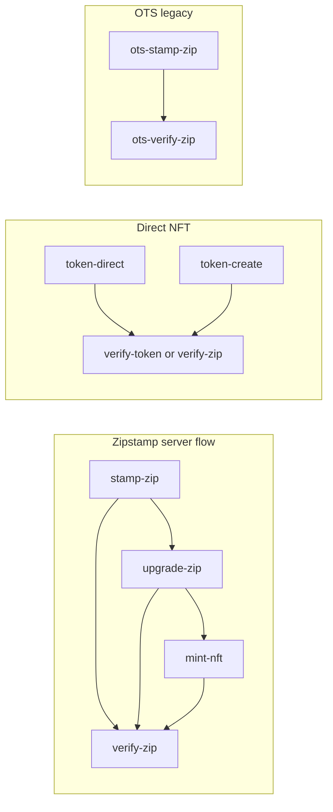

# NeoZip Blockchain Examples

Examples demonstrating blockchain timestamping, NFT minting, and verification using `neozip-blockchain` with `neozipkit` for ZIP operations.

## Overview

NZIP (NeoZip) files are ZIP archives with embedded blockchain proofs. These examples demonstrate:

- **Timestamping**: Create timestamped ZIP files via Zipstamp server (Ethereum blockchain)
- **NFT Proof**: Mint NFT tokens that prove ownership and link to timestamps
- **Verification**: Verify ZIP files against the blockchain (pending, confirmed, or NFT proofs)
- **OpenTimestamps**: Legacy Bitcoin-based timestamping (add-on)

## Quick Reference

| Script | File | Purpose | Workflow | Prerequisites |
|--------|------|---------|----------|---------------|
| `verify-email` | [verify-email.ts](verify-email.ts) | Register and verify email for Zipstamp server | Zipstamp server | Zipstamp server |
| `example:timestamp` | [stamp-zip.ts](stamp-zip.ts) | Create timestamped ZIP (TS-SUBMIT.NZIP) | Zipstamp server | Zipstamp server |
| `example:upgrade` | [upgrade-zip.ts](upgrade-zip.ts) | Upgrade pending → confirmed (TIMESTAMP.NZIP) | Zipstamp server | Zipstamp server |
| `example:mint-nft` | [mint-nft.ts](mint-nft.ts) | Mint NFT from timestamped ZIP (adds TOKEN.NZIP) | Zipstamp server | Zipstamp server, wallet |
| `example:verify-timestamp` | [verify-zip.ts](verify-zip.ts) | Verify pending timestamp | Verify | Zipstamp server |
| `example:verify-upgrade` | [verify-zip.ts](verify-zip.ts) | Verify confirmed timestamp | Verify | None (offline) |
| `example:verify-nft` | [verify-zip.ts](verify-zip.ts) | Verify NFT token | Verify | None (offline) |
| `example:token-srv` | [token-create.ts](token-create.ts) | Create ZIP + mint NFT (UnifiedNFT) | Direct NFT | Wallet |
| `example:token-direct` | [token-direct.ts](token-direct.ts) | Create ZIP + mint NFT (ZipkitMinter, v2.51) | Direct NFT | Wallet |
| `example:verify-token` | [verify-token.ts](verify-token.ts) | Verify tokenized ZIP (simpler) | Verify | None |
| `example:ots-stamp` | [ots-stamp-zip.ts](ots-stamp-zip.ts) | Create ZIP + OpenTimestamps proof | OTS | None |
| `example:ots-verify` | [ots-verify-zip.ts](ots-verify-zip.ts) | Verify OTS proof | OTS | None |

## Workflows

### Zipstamp Server Flow (Primary)

The recommended flow for timestamping ZIP files:

**Before stamp/upgrade/mint:** Examples that use the Zipstamp server (stamp-zip, upgrade-zip, mint-nft) require a verified email. Run `yarn verify-email` once to register and verify your email; the script saves it to `.env.local` (as `ZIPSTAMP_EMAIL`, and optionally `TOKEN_SERVER_EMAIL` for backward compatibility) so you don't need to pass `--email` each time. For a non-interactive register/verify split, use [zipstamp-server-auth.ts](zipstamp-server-auth.ts) or [token-server-auth.ts](token-server-auth.ts) (legacy name, same behavior).

1. **Stamp** → Create timestamped ZIP with pending proof (TS-SUBMIT.NZIP)
2. **Upgrade** → Once batch is confirmed, upgrade to confirmed proof (TIMESTAMP.NZIP)
3. **Mint NFT** (optional) → Create NFT proof token (adds TOKEN.NZIP)



#### 1. Stamp ZIP (`stamp-zip.ts`)

Creates a timestamped ZIP file by submitting the merkle root to the Zipstamp server. The server batches submissions and mints them on-chain.

**What it does:**
- Creates a ZIP file from input files (supports wildcards)
- Calculates merkle root for integrity verification
- Submits merkle root to Zipstamp server for timestamping
- Adds `META-INF/TS-SUBMIT.NZIP` metadata (pending proof)

**Usage:**
```bash
# Using yarn script (recommended)
yarn example:timestamp examples/output/stamp.nzip examples/test-files/*

# Using ts-node directly
ts-node examples/stamp-zip.ts examples/output/stamp.nzip examples/test-files/*

# With custom Zipstamp server URL
ZIPSTAMP_SERVER_URL=https://zipstamp-dev.neozip.io yarn example:timestamp examples/output/stamp.nzip examples/test-files/*
```

**Requirements:**
- Zipstamp server (default: `https://zipstamp-dev.neozip.io`); set `ZIPSTAMP_SERVER_URL` if different
- No wallet or private keys needed (server handles blockchain transactions)

**Output:**
- Creates `examples/output/stamp.nzip` with embedded timestamp metadata
- Displays digest, batch number, and status

#### 2. Upgrade ZIP (`upgrade-zip.ts`)

Upgrades a pending timestamp (TS-SUBMIT.NZIP) to a confirmed timestamp (TIMESTAMP.NZIP) once the batch has been minted on the blockchain.

**What it does:**
- Checks if the batch has been confirmed on the blockchain
- Downloads complete proof data (merkle proof, transaction hash, etc.)
- Creates a new ZIP file with `META-INF/TIMESTAMP.NZIP` containing complete proof
- Original ZIP file is preserved
- Upgraded ZIP can be verified directly against the blockchain without the Zipstamp server

**Usage:**
```bash
# Using yarn script (recommended)
yarn example:upgrade examples/output/stamp.nzip

# Using ts-node directly
ts-node examples/upgrade-zip.ts examples/output/stamp.nzip

# Wait until batch is confirmed
ts-node examples/upgrade-zip.ts examples/output/stamp.nzip --wait

# Custom output filename
ts-node examples/upgrade-zip.ts examples/output/stamp.nzip examples/output/stamp-upgrade.nzip
```

**Requirements:**
- Zipstamp server must be running
- Input ZIP must have `META-INF/TS-SUBMIT.NZIP` (from `stamp-zip.ts`)
- Batch must be confirmed on blockchain (use `--wait` to poll)

**Output:**
- Creates `examples/output/stamp-upgrade.nzip` (or custom name) with `META-INF/TIMESTAMP.NZIP`
- Displays transaction hash, block number, and merkle proof details

#### 3. Mint NFT (`mint-nft.ts`)

Mints an NFT proof token for a timestamped ZIP file. The NFT proves ownership and links to the original timestamp transaction.

**What it does:**
- Reads ZIP file and extracts `META-INF/TIMESTAMP.NZIP` metadata
- Calls Zipstamp server to prepare mint data
- Checks if the digest is already minted
- Sends `mintWithTimestampProof()` transaction from user's wallet
- Creates a new ZIP with `META-INF/TOKEN.NZIP` containing extended metadata

**Usage:**
```bash
# Using yarn script (recommended)
USER_PRIVATE_KEY=0x... yarn example:mint-nft examples/output/stamp-upgrade.nzip

# Using ts-node directly
ts-node examples/mint-nft.ts examples/output/stamp-upgrade.nzip --private-key 0x...

# With custom chain ID
ts-node examples/mint-nft.ts examples/output/stamp-upgrade.nzip --private-key 0x... --chain-id 84532

# Custom output filename
ts-node examples/mint-nft.ts examples/output/stamp-upgrade.nzip examples/output/stamp-nft.nzip --private-key 0x...
```

**Requirements:**
- Zipstamp server must be running
- `USER_PRIVATE_KEY` environment variable or `--private-key` flag (testnet only!)
- Input ZIP must have `META-INF/TIMESTAMP.NZIP` (from `upgrade-zip.ts`)
- Testnet ETH for gas fees

**Output:**
- Creates `examples/output/stamp-upgrade-nft.nzip` (or custom name) with `META-INF/TOKEN.NZIP`
- Displays token ID, transaction hash, and blockchain explorer link

### Verification

#### Verify ZIP (`verify-zip.ts`)

Universal verifier that supports three modes:

1. **PENDING (TS-SUBMIT.NZIP)** - Verifies via Zipstamp server
   - Checks if digest is in database/batch
   - Suggests running `upgrade-zip.ts` once confirmed

2. **CONFIRMED (TIMESTAMP.NZIP)** - Direct blockchain verification
   - Uses embedded merkle proof to verify on-chain
   - No Zipstamp server required (self-contained proof)
   - Similar to OpenTimestamps upgraded timestamps

3. **NFT TOKEN (TOKEN.NZIP; legacy NZIP.TOKEN accepted)** - NFT proof verification
   - Verifies NFT ownership on TimestampProofNFT contract
   - Verifies token's stored proof data matches metadata
   - Links to original timestamp transaction for full provenance

**Usage:**
```bash
# Verify pending timestamp (requires Zipstamp server)
yarn example:verify-timestamp examples/output/stamp.nzip

# Verify confirmed timestamp (offline, no Zipstamp server needed)
yarn example:verify-upgrade examples/output/stamp-upgrade.nzip

# Verify NFT token (offline, no Zipstamp server needed)
yarn example:verify-nft examples/output/stamp-upgrade-nft.nzip

# Using ts-node directly
ts-node examples/verify-zip.ts examples/output/stamp.nzip

# Offline mode (skip Zipstamp server check)
ts-node examples/verify-zip.ts examples/output/stamp-upgrade.nzip --offline
```

**Requirements:**
- For pending: Zipstamp server must be running
- For confirmed/NFT: No Zipstamp server needed (offline verification)

**Output:**
- Verification status (valid/pending/error)
- Merkle root comparison
- Blockchain data validation
- Explorer links to view transactions

#### Verify Token (`verify-token.ts`)

Simpler verifier for tokenized ZIP files (TOKEN.NZIP; legacy NZIP.TOKEN accepted for reading). Use this if you only need to verify NFT tokens without timestamp proofs.

**Usage:**
```bash
# Using yarn script
yarn example:verify-token examples/output/token-direct.nzip

# Using ts-node directly
ts-node examples/verify-token.ts examples/output/token-direct.nzip
```

**Requirements:**
- Tokenized ZIP file with `META-INF/TOKEN.NZIP` (legacy `META-INF/NZIP.TOKEN` accepted for verification)
- No private keys required (read-only blockchain operations)

### Direct NFT Flow (No Timestamp Server)

Create ZIP files with NFT tokens directly, without using the Zipstamp server timestamping flow.

#### Token Direct (`token-direct.ts`)

Creates a tokenized NZIP file using the core `ZipkitMinter` API and the **NZIP contract v2.51** (default network: Base Sepolia).

**What it does:**
- Creates a ZIP file from test files
- Calculates merkle root for integrity verification
- Prompts: **1) Use existing token** (if you have one), **2) Mint a new token**, **3) Cancel**
- Before minting, prompts "Proceed with mint? (y/N)" so you can abort
- Embeds token metadata in `META-INF/TOKEN.NZIP`

**Usage:**
```bash
# Using yarn script
USER_PRIVATE_KEY=0x... yarn example:token-direct

# Using ts-node directly
USER_PRIVATE_KEY=0x... ts-node examples/token-direct.ts

# With custom network
NEOZIP_NETWORK=base-sepolia USER_PRIVATE_KEY=0x... ts-node examples/token-direct.ts
```

**Requirements:**
- `USER_PRIVATE_KEY` environment variable with testnet private key
- Testnet ETH for gas fees
- Network configuration (defaults to Base Sepolia testnet, v2.51)

**Output:**
- Creates `examples/output/token-direct.nzip` with embedded token metadata
- Displays token ID, transaction hash, and blockchain explorer link

#### Token Create (`token-create.ts`)

Creates a tokenized ZIP file using the UnifiedNFT contract directly.

**What it does:**
- Creates a ZIP file from input files
- Mints an NFT on the UnifiedNFT contract
- Adds `META-INF/TOKEN.NZIP` metadata
- NFT timestamp comes from the block in which the NFT is minted

**Usage:**
```bash
# Using yarn script
USER_PRIVATE_KEY=0x... yarn example:token-srv examples/output/token-test.nzip examples/test-files/*

# Using ts-node directly
ts-node examples/token-create.ts examples/output/token-test.nzip examples/test-files/* --private-key 0x...

# With custom chain ID
ts-node examples/token-create.ts examples/output/token-test.nzip examples/test-files/* --private-key 0x... --chain-id 84532
```

**Requirements:**
- `USER_PRIVATE_KEY` environment variable or `--private-key` flag (testnet only!)
- Testnet ETH for gas fees

**Output:**
- Creates `examples/output/token-test.nzip` with embedded token metadata
- Displays token ID, transaction hash, and blockchain explorer link

**Difference from `token-direct.ts`:**
- `token-direct.ts` uses `ZipkitMinter` (core API, NZIP v2.51)
- `token-create.ts` uses UnifiedNFT contract directly (via ethers)
- Both create ZIP files with TOKEN.NZIP, but use different minting APIs

### OpenTimestamps (Legacy)

Bitcoin-based timestamping using OpenTimestamps protocol. This is a legacy/add-on feature. For primary timestamping, use the Zipstamp server flow above.

#### OTS Stamp ZIP (`ots-stamp-zip.ts`)

Creates a ZIP file with OpenTimestamps proof.

**What it does:**
- Creates a ZIP from input files
- Computes merkle root
- Requests an OpenTimestamps proof
- Adds `META-INF/TS-SUBMIT.OTS` to the archive

**Usage:**
```bash
# Using yarn script
yarn example:ots-stamp examples/output/ots.nzip examples/test-files/*

# Using ts-node directly
ts-node examples/ots-stamp-zip.ts examples/output/ots.nzip examples/test-files/*
```

**Requirements:**
- No wallet or server needed
- OpenTimestamps calendar servers must be accessible

**Output:**
- Creates `examples/output/ots.nzip` with `META-INF/TS-SUBMIT.OTS`
- Displays OTS proof size

#### OTS Verify ZIP (`ots-verify-zip.ts`)

Verifies OpenTimestamps proof in a ZIP file.

**Usage:**
```bash
# Using yarn script
yarn example:ots-verify examples/output/ots.nzip

# Using ts-node directly
ts-node examples/ots-verify-zip.ts examples/output/ots.nzip
```

**Requirements:**
- ZIP file with `META-INF/TS-SUBMIT.OTS` or `META-INF/TIMESTAMP.OTS`

**Output:**
- Verification status (valid/pending/error)
- Bitcoin block height (if attested)
- Attestation date (if available)

## Prerequisites

### Required Packages

The `neozipkit` package must be installed:

```bash
npm install neozipkit
# or
yarn add neozipkit
```

**Note**: 
- `neozipkit` must be installed as a package: `npm install neozipkit`
- These examples use:
  - Installed `neozipkit` package for ZIP file operations
  - Local source files from `../src` for blockchain operations (package not yet published)

### Development Tools

- Node.js 16+
- TypeScript (for running with ts-node)
- ts-node (for running examples directly)

```bash
npm install -g ts-node
# or use npx
npx ts-node examples/stamp-zip.ts
```

### Environment Variables

Create a `.env` file (excluded from git) for private keys:

```bash
# Create .env file
echo "USER_PRIVATE_KEY=0x..." > .env
echo "ZIPSTAMP_SERVER_URL=https://zipstamp-dev.neozip.io" >> .env
```

## Zipstamp Server Setup

The Zipstamp server flow examples require a Zipstamp server to be running. The Zipstamp server handles blockchain transactions on behalf of users, similar to OpenTimestamps calendar servers.

### Quick Start

1. **Start the Zipstamp server** (in a separate terminal):
   ```bash
   cd ../zipstamp
   npm install
   npm run dev
   ```

2. **Verify server is running**:
   ```bash
   curl https://zipstamp-dev.neozip.io/status
   ```

3. **Run timestamp examples**:
   ```bash
   yarn example:timestamp examples/output/stamp.nzip examples/test-files/*
   ```

### Zipstamp Server Configuration

The Zipstamp server requires:
- `DATABASE_URL` - PostgreSQL connection string
- `SERVER_WALLET_PRIVATE_KEY` - Private key of server wallet
- `DEFAULT_NETWORK` - Ethereum network (base-sepolia, base, ethereum, etc.)
- `RPC_URL` - Ethereum RPC endpoint

See the Zipstamp project README for detailed setup instructions.

### Comparison with OpenTimestamps

| Feature | OpenTimestamps | ETH Timestamping |
|---------|---------------|------------------|
| Blockchain | Bitcoin | Ethereum (Base, Arbitrum, etc.) |
| Protocol | OTS | NZIP Tokens |
| User Wallet | Not required | Not required |
| Aggregation | Calendar servers | Direct token minting |
| Verification | Bitcoin block headers | Ethereum contract calls |
| Metadata Format | Binary OTS proof | JSON metadata |

## Example File Structure

```
examples/
├── stamp-zip.ts              # Create timestamped ZIP (Zipstamp server)
├── upgrade-zip.ts            # Upgrade pending → confirmed
├── mint-nft.ts               # Mint NFT from timestamp
├── verify-zip.ts             # Universal verifier (pending/confirmed/NFT)
├── token-create.ts           # Create ZIP + mint NFT (UnifiedNFT)
├── token-direct.ts           # Create ZIP + mint NFT (ZipkitMinter, v2.51)
├── verify-token.ts           # Verify tokenized ZIP (simpler)
├── ots-stamp-zip.ts          # Create ZIP + OpenTimestamps proof
├── ots-verify-zip.ts         # Verify OTS proof
├── README.md                 # This file
├── output/                   # Generated ZIP files
│   ├── stamp.nzip           # Timestamped ZIP (pending)
│   ├── stamp-upgrade.nzip   # Timestamped ZIP (confirmed)
│   ├── stamp-upgrade-nft.nzip # Timestamped ZIP with NFT
│   ├── token-direct.nzip   # Tokenized NZIP (direct mint, v2.51)
│   ├── token-test.nzip      # Tokenized ZIP (UnifiedNFT)
│   └── ots.nzip             # OTS timestamped ZIP
└── test-files/              # Test data files
    ├── document.txt
    ├── data.json
    └── README.md
```

**Note**: `test-files/stamp-zip.ts` is a convenience copy for local testing and can be ignored.

## Security Best Practices

### Private Key Handling

**CRITICAL**: Never commit private keys to version control or include them in your code.

#### Environment Variables

Always use environment variables for private keys:

```bash
# Create .env file (excluded from git)
echo "USER_PRIVATE_KEY=0x..." > .env

# Load environment variables
export $(cat .env | xargs)
```

#### Testnet vs Mainnet

- **Examples**: ONLY use testnet keys (Base Sepolia, Arbitrum Sepolia, Ethereum Sepolia)
- **Development**: Use testnet keys with minimal test funds
- **Production**: Use secure key management (HSMs, KMS)

#### What to Do If Keys Are Exposed

If you accidentally commit a private key:

1. **Immediately rotate the key** - Generate a new key and transfer any funds
2. **Remove from git history** - Use `git filter-branch` or BFG Repo-Cleaner
3. **Check for unauthorized access** - Monitor the wallet address for transactions
4. **Update all systems** - Replace the key in all environments

#### Best Practices Checklist

- [ ] Use `.env` file for private keys (excluded from git)
- [ ] Only use testnet keys for examples
- [ ] Never hardcode private keys in source code
- [ ] Verify `.gitignore` excludes wallet files
- [ ] Use secure key management for production
- [ ] Rotate keys regularly
- [ ] Monitor for exposed secrets

## Troubleshooting

### Module Resolution Errors

If you see "Cannot find module" errors:

```bash
# Ensure neozipkit is installed
npm install neozipkit

# Verify installation
npm list neozipkit
```

### TypeScript Errors

If you see TypeScript errors:

```bash
# Install TypeScript types
npm install -D @types/node typescript

# Verify tsconfig.json is properly configured
```

### Blockchain Example Errors

If the blockchain example fails:

- **Verify wallet has testnet ETH**: Check balance on [Base Sepolia Explorer](https://sepolia.basescan.org)
- **Check network connectivity**: Ensure RPC endpoints are accessible
- **Verify `USER_PRIVATE_KEY` is set**: Run `echo $USER_PRIVATE_KEY`
- **Check network name**: Use `base-sepolia`, `arbitrum-sepolia`, or `ethereum-sepolia`
- **Get testnet ETH**: Use [Base Sepolia Faucet](https://www.coinbase.com/faucets/base-ethereum-sepolia-faucet)

### ZIP File Errors

If ZIP operations fail:

- **Verify neozipkit is installed**: `npm list neozipkit`
- **Check file permissions**: Ensure read/write access to example directories
- **Verify ZIP file structure**: Use `verify-zip.ts` to check file integrity

### Zipstamp Server Errors

If Zipstamp server examples fail:

- **Verify server is running**: `curl https://zipstamp-dev.neozip.io/status` (or your `ZIPSTAMP_SERVER_URL`)
- **Check `ZIPSTAMP_SERVER_URL`**: Ensure it matches your server URL
- **Check server logs**: Look for errors in the Zipstamp server terminal

## Integration Guide

### Using in Your Own Projects

These examples demonstrate the integration pattern:

1. **ZIP Operations** → Use installed neozipkit package
   ```typescript
   import { ZipkitNode } from 'neozipkit/node';
   ```

2. **Blockchain Operations** → Use local source files (until package is published)
   ```typescript
   import { ZipkitMinter } from '../src/core/ZipkitMinter';
   import { ZipkitVerifier } from '../src/core/ZipkitVerifier';
   ```

3. **Constants** → Import from local source files
   ```typescript
   import { TOKENIZED_METADATA } from '../src/core/contracts';
   ```

### Example Integration

```typescript
// Create ZIP with neozipkit (installed package)
import { ZipkitNode } from 'neozipkit/node';
const zip = new ZipkitNode();
await zip.createZipFromFiles(files, outputPath, { useSHA256: true });

// Mint token with neozip-blockchain (local source)
import { ZipkitMinter } from '../src/core/ZipkitMinter';
const minter = new ZipkitMinter(merkleRoot, { walletPrivateKey, network });
const result = await minter.mintToken();

// Verify with neozip-blockchain (local source)
import { ZipkitVerifier } from '../src/core/ZipkitVerifier';
const verifier = new ZipkitVerifier();
const verification = await verifier.verifyToken(tokenMetadata, merkleRoot);
```

## Supported Networks

| Network | Chain ID | Status | Explorer |
|---------|----------|--------|----------|
| Base Sepolia | 84532 | Testnet | [BaseScan](https://sepolia.basescan.org) |
| Base Mainnet | 8453 | Production | [BaseScan](https://basescan.org) |
| Arbitrum Sepolia | 421614 | Testnet | [Arbiscan](https://sepolia.arbiscan.io) |
| Ethereum Sepolia | 11155111 | Testnet | [Etherscan](https://sepolia.etherscan.io) |

## Next Steps

1. **Understand the API**: Read the [main README](../README.md) for detailed API documentation
2. **Explore Advanced Features**: Check out the blockchain integration examples
3. **Build Your Own Tools**: Use these examples as a starting point for your own applications
4. **Check Documentation**: See [MIGRATION.md](../docs/MIGRATION.md) for migration from neozipkit

## License

These examples are part of the `neozip-blockchain` package and are licensed under the same license as the package.
